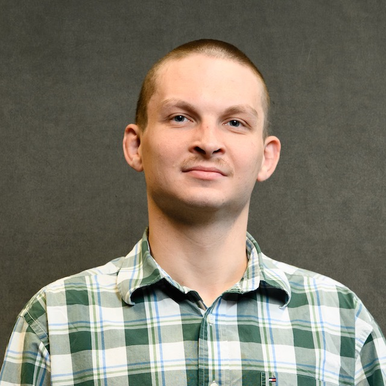

<!-- &bull;&nbsp;text  -->
<b>Lab Members</b> 
<b>Graduates</b>: 
<!-- 

  
  

    
<b>Ph.D.: Bryson Hedrick</b> 
    B.S., Appalachian State University (2024) 
    Bryson is from a background of physics, where he worked in optical tweezers at Appalachian State and nanofabrication at UT-ORII. Specifically, his research project is on machine learning, ceramics, and image processing. He does hiking, primitive living skills, climbing, foraging, DnD, and coding in his free time.

  

 -->
 
 

<!-- <b>M.S.: JohnDoe2 </b>, Fall 2025, (xxx@clemson.edu) 
Education: B.S., xxx University (2020) 
say something about yourself. 
 
<b>Undergraduates</b>: 
 
JaneDoe3, Fall 2025, (xxx@clemson.edu) 
say something about yourself. 
  -->
<b>Alumni</b>: 
Not this soon.. 

<!-- <b>Group Member Awards and Accomplishments</b> 
 
<b>Group Member Internships and Employments</b> 
 
 -->
<b>Possible Openings</b> 
&bull;&nbsp;<strong>Postdocs</strong> with <u>proven experience</u> and expertise in: energy materials (batteries, catalysts, fuel cells), in situ characterization (diffraction, scattering, microscopy), and artificial intelligence (machine learning, deep learning, computer vision). 
&bull;&nbsp;<strong>Ph.D. and M.S.</strong> students with a background and <u>strong interests</u> in: energy storage, ceramic engineering, and advanced characterization. More details about our <a href="https://www.clemson.edu/cecas/departments/mse/academics/graduate/index.html">MSE Graduate Program</a>. 
&bull;&nbsp;<strong>Undergraduate</strong> students in MSE or related majors with an interest in the above research topics are <u>encouraged</u> to apply. 
&bull;&nbsp;<strong>Visiting scholars and interns</strong> with an interest in the above research topics are welcomed to apply. 
<small> Send inquiry emails to Dr. Hou (hou4+inquiry@clemson.edu). With the subject specifying your name, the position, and the expected start time, e.g. Application_Postdoc_JohnDoe_2025fall.  Please keep your email <strong><u>concise</u></strong>, state briefly why you are interested in this lab, what’s your preliminary plan, and attach a CV. No need for other documents or certificates (your email is your cover letter). If you are applying to a specific advertisement, note this in your email. </small>

<b>About Clemson University</b> 
&bull;&nbsp;Clemson University is a leading public research institution located in Clemson, South Carolina, classified among “R1: Doctoral Universities – Very high research activity”. <a href="https://donghou-lab.github.io/assets/images/clemson_gallery.pdf">Gallery of our campus</a> 
&bull;&nbsp;Clemson University’s College of Engineering, Computing, and Applied Sciences (CECAS) is committed to producing outstanding graduates. Our MSE program <u>ranks #1 for the state of South Carolina</u> by College Factual and EduRank, and 29th among national public universities by US News and World Report. 
&bull;&nbsp;Clemson is listed as Top 10 <u>Best Small College Towns</u>, per <a href="https://10best.usatoday.com/awards/best-small-college-town/">USA TODAY reviews</a> 
<!-- &bull;&nbsp;Clemson University and our lab do not discriminate against any person or group based on age, color, disability, gender, pregnancy, national origin, race, religion, sexual orientation, veteran status or genetic information. <strong>Women, racial and ethnic minorities, individuals with disabilities, and veterans are encouraged</strong> to join us.  -->
<!-- To support diversity, inclusion, and equity, the <em>Division of Research</em> established a committee of peers and enacted an <a href="https://www.clemson.edu/research/division-of-research/about-division/inclusiveness.html">Inclusive Excellence Strategic Plan</a>.  -->

<b>Fellowship and Scholarship Opportunities</b> 
We are committed to workforce training and professional development in STEM fields, please contact us if you are interested in working with us through these opportunities. 
&bull;&nbsp;Undergraduates: <a href="https://www.clemson.edu/cecas/students/engagement/opportunities.html">CECAS Opportunity Grants</a>, <a href="https://www.clemson.edu/cuhonors/opportunities/breakthrough-scholars/index.html">Breakthrough Scholars Program</a>, <a href="https://www.clemson.edu/centers-institutes/watt/creative-inquiry/index.html">Creative Inquiry</a>, and many others. 
&bull;&nbsp;Graduates: <a href="https://www.clemson.edu/major-fellowships/search-fellowships/index.html">Major Fellowships</a>, DOE Office of Science Graduate Student Research (<a href="https://science.osti.gov/wdts/scgsr">SCGSR</a>) Program, NSF Graduate Research Fellowship Program (<a href="https://www.nsfgrfp.org/">GRFP</a>), NSF EPSCoR Graduate Fellowship Program (<a href="https://new.nsf.gov/funding/opportunities/nsf-epscor-graduate-fellowship-program-egfp">EGFP</a>), and many others. 
&bull;&nbsp;Postdocs: <a href="https://new.nsf.gov/funding/postdocs">NSF Postdoctoral Fellowships</a>, American Society for Engineering Education (<a href="https://efellows.asee.org">ASEE</a>) eFellows, <a href="https://www.clemson.edu/research/division-of-research/resources/r-init-sub-pages/research-fellows.html">Clemson Research Fellows</a>, and many others. 
 

<b>Teamwork</b> leads to proper perfection.  
  
A pit stop, 4 tires swapping, by 22 human beings, in less than 2 seconds. Truthfully, it’s an art.  Source: Red Bull Racing, <a href="https://www.youtube.com/watch?v=wsCriICZ-nA">2019 Brazilian GP</a>. 
 
<b>Friends of our lab</b> (at least in my personal perspective)

  
   
  

&bull;&nbsp;The Tiger, Dum Spiro Spero (While I breathe, I hope) 
&bull;&nbsp;Hokie Bird, Ut Prosim (That I May Serve) 
&bull;&nbsp;Wolfpack, Think and Do 